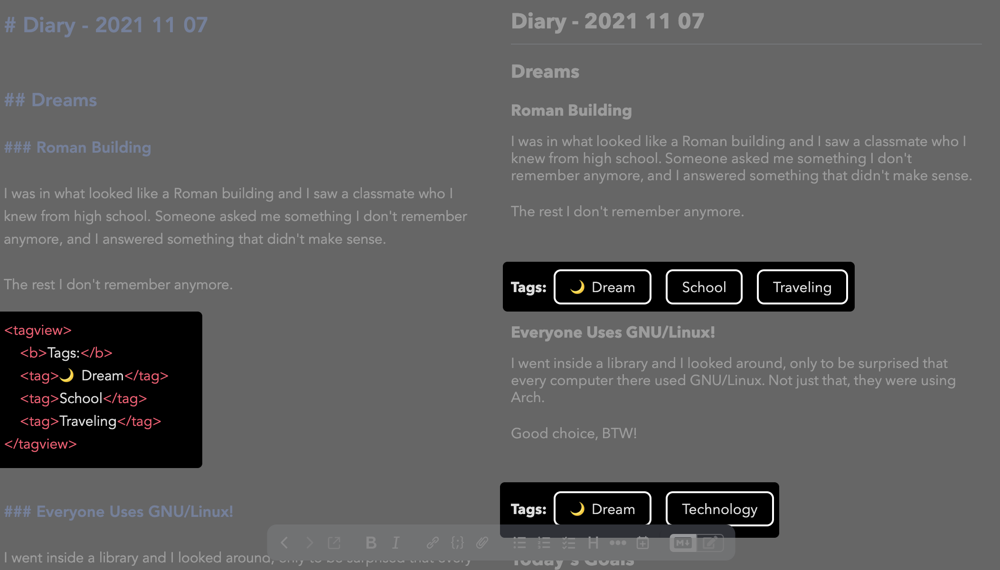

# Tag View Snippet for Joplin

This little snippet shows a tag view within your notes. Note that this will not update the tags within Joplin by itself; it's only meant to be for cosmetic purposes.

This snippet also contains code to make it appear pretty when printed. 



## Installing

Open Joplin and go to ``Help > Open Profile Directory``. From there, open ``userstyle.css`` inside your favorite code editor and paste the contents of ``tags.css`` inside that file. 


## Using Tag View Snippet

To use the Tag View Snippet, place the following code wherever you'd like to put the tag:

```html
<tagview>
	<b>Tags:</b>
	<tag>Tag 1</tag> 
	<tag>Tag 2</tag> 
	<tag>Tag 3</tag>
</tagview>
```

You can modify the ``Tags:`` to say whatever you like. Removing the ``<b>`` tag will remove the bold style from the text, if you prefer that. 


## Customizing the Tag View Snippet

If you'd like to customize the look and feel of the Tag View Snippet, I encourage you to do so! I've commented every line inside the CSS file to make it as easy to understand as possible, even for a beginner.